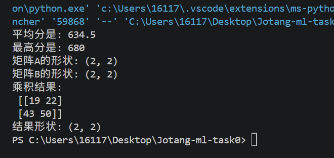

# Task0 机器学习入门笔记

## 基础概念
1. 人工智能,机器学习和深度学习有什么关系?
人工智能:让机器表现出类似人类智能的行为(范围最大)(让机器变聪明),让机器能够推理,学习,感知,理解语言,决策和行动(如早期专家系统:知识库存储特定领域的专家经验,推理器依据知识库中的规则和用户输入的数据,进行推理并得出结论;下棋程序等)
机器学习:人工智能的一个子领域,核心思想是让机器从数据中自动学习规律，而不是由人显式编写规则(让机器从数据中变聪明).
机器学习需要特征工程:人需要从原始数据中提取有用的特征，再喂给算法。
深度学习:机器学习的一个子领域,基于多层神经网络来自动学习数据的层次化表示。(让机器用神经网络从大量数据中变聪明)需要大量数据与很高的算力需求.
总之,人工智能包含机器学习,机器学习包含深度学习

2. 监督学习和无监督学习有什么区别?举例
监督学习:将输入X映射到输出Y,算法从"正确答案"中学习.有回归和分类两种类型.例子:判断肿瘤的良性和恶性或区分正常文件和垃圾文件
无监督学习:得到数据没有和任何输出标签Y相关,没有给算法正确答案,而是算法在数据中找到结构,模式或规律.(聚类算法,异常检测,降维)例子:新闻文章的分组.

3. 数据、特征和标签分别是什么？训练集、验证集和测试集各有什么用途？
数据:关于某个事物所有信息记录的集合,特征：描述数据的属性,标签：我们要预测的结果.
训练集：用来训练模型,让模型学习(像作业题),验证集：在训练过程中，用来评估效果、调整参数的数据。测试集：模型完全训练好之后，用来做最终评估的数据(像最后考试).

4. batch size是什么？有什么影响？
batch size 是每次喂给模型的样本数量
太大:训练速度和稳定性更快更稳,占用显存更大可能会导致程序崩溃,而且模型容易陷入局部最优
太小:占用显存少,训练震荡大(由于个别数据带偏方向)收敛慢(找到规律的速度慢). 

5. 什么是模型和模型参数？
模型：理解为一个数学公式，告诉输入特征和输出标签之间的映射关系,即根据输入预测输出
模型参数：公式里面的未知数,可以被训练,自动学习更新(y=wx+b里的w,b)

6. 神经网络由哪些基本部分组成？什么是激活函数？为什么要激活函数？请介绍几种常见的激活函数。
神经网络组成部分:输入层,隐藏层,输出层;每层由许多神经元组成，层与层之间通过权重连接(两层神经元之间的连线,线上带有的数字)。
激活函数：是一种非线性函数(加在层后面)
 如果没有激活函数，神经网络就是单层的线性回归，只能拟合线性关系。激活函数引入非线性，让网络可以学习复杂规律,拟合复杂的现实问题。
Sigmoid：将输出压缩到 0~1 之间，,缺点是容易出现梯度消失。
Tanh：将输出-1~1。
ReLU：当输入大于0时保持不变，小于0时输出0。计算简单、收敛快.

7. 矩阵如何求导？提前学习该部分数学。
矩阵求导是批量对矩阵内每一个元素(权重)分别单独做偏导数计算(多元函数里,固定其他变量,只让一个变量发生微小变化对应的函数变化率(与普通导数类比),而将所有偏导数打包就是梯度向量(损失上升最快的方向)),求导结果矩阵是和原矩阵形状相同的矩阵. 在神经系统的反向传播中,依靠矩阵求导和链式法则(计算多层嵌套的符合函数:从后往前每层的偏导数相乘)求出损失对所有权重的梯度,交给优化器更新参数

8. 怎么用矩阵乘法表示神经网络的全连接层前向传播过程？
Y=X*W+b 输出Y=输入X*权重W+偏置b 单个神经元的计算是:输入*权重+偏置 矩阵将全部样本,所有权重打包,通过矩阵乘法一次性批量计算所有样本在这一层全部神经元的输出

9. 前向传播与反向传播分别在做什么？损失函数、梯度和学习率在训练过程中扮演什么角色？
前向传播：输入数据经过一层层计算(从输入层到输出层)，最终得到预测结果的过程。
反向传播：根据预测结果和真实标签的误差，利用链式法则(求复合函数的导数,即一层一层求导然后相乘)，从后往前计算每一层参数的梯度(损失对每一个权重的偏导数组合起来)，从而更新参数。
损失函数：衡量模型预测值和真实值之间的差距。值越小,预测越准。
梯度：损失函数相对于参数的变化率，指明损失上升快的方向(训练模型要往梯度的反方向更新参数,减小误差)
学习率：决定了每次参数更新走多大一步。步子太大容易震荡不收敛，太小则训练太慢。

10. 优化器是什么？有哪些？
优化器:利用梯度信息(相当于告诉方向),自动更新模型参数(w,b),降低损失(让损失函数不断变小)
常用的优化器:SGD随机帝梯度下降:每次一小批batch计算梯度然后更新;Momentum(动量SGD):增加惯性(动量),积累历史梯度然后更新参数;RMSprop:自适应调整学习率(梯度大的参数缩小);Adam:结合动量和学习率,最常用,收敛快且稳定

11. 什么是过拟合，欠拟合，正则化？
欠拟合：模型简单了，连训练集里的规律都不会,训练误差高
过拟合：把训练集里的噪音和特例都记住了,训练集效果好但是测试集差
正则化：为了防止过拟合采取的技术,用来约束的模型,不让参数变得太大

## 环境搭建相关问题
1. 不同项目可能依赖同一个库的不同版本,虚拟环境能将依赖隔离,防止版本冲突,确保每个项目都能稳定运行
2. CPU擅长逻辑控制,串行计算和复杂的通用计算(复杂但少量);GPU拥有数千个计算核心,擅长高度并行的计算,尤其是矩阵乘法(简单但大量);原因:神经网络的训练涉及海量的矩阵乘法和加法运算,GPU的并行计算架构能极大加速这一过程
3. CUDA:是NVIDIA(显卡硬件)推出的通用并行计算平台,显卡驱动是底层硬件与系统沟通的桥梁;PyTorch等深度学习框架通过调用CUDA接口,最终将张量运算任务交给NVIDIA显卡(GPU)执行.没有GPU或CUDA,PyTorch自动使用CPU计算  显卡:车 显卡驱动:钥匙 CUDA=NVIDIA:公路(完成任务路径) PyTorch:司机

  

