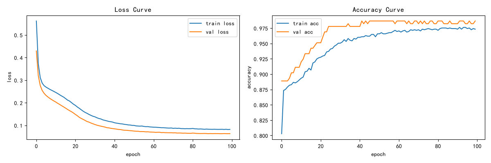
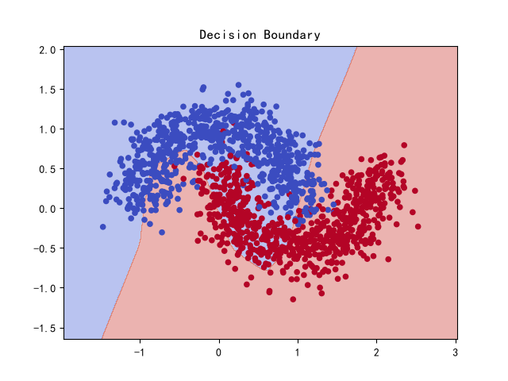
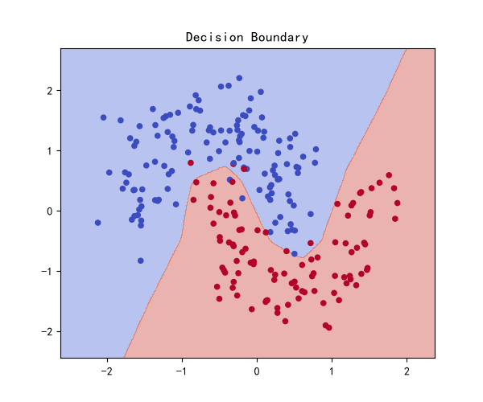
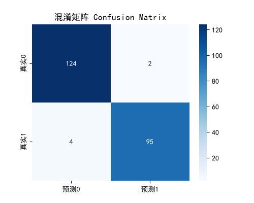
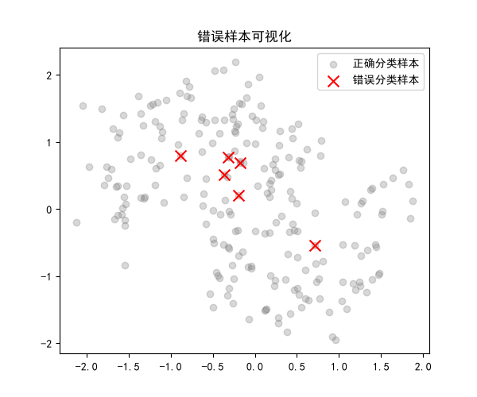

# 一、运行
直接运行train.py即可复现所有结果
环境依赖：Python 3.11, PyTorch, NumPy, Scikit-learn, Matplotlib, Seaborn

#二、实验设计与实现
1. 数据准备：使用make_moons生成1500个数据点，按 7:1.5:1.5 划分 Train/Val/Test，使用StandardScaler标准化(fit仅在训练集，防止数据泄漏)
2. 模型结构：MLP(输入2 -> 隐藏层64, ReLU -> 输出层2)
3. 训练细节：CrossEntropyLoss 损失函数，Adam优化器，lr=0.001，训练100轮。
4. 模型保存与加载：训练后保存为 mlp_model.pth，后续通过 load_state_dict 加载并在测试集上验证

# 三、实验结果图表

# 四、消融实验对比表
实验分析总结：
本次实验严格采用了控制变量法
1. 模型宽度影响：宽度从16增加到256，参数量成倍增加，训练速度变慢、显存占用增大，但验证集准确率并未提升（甚至略微下降）。说明模型并非越宽越好。
2. 学习率影响：lr=0.0001时准确率低,Loss高，说明学习率过小会导致收敛极慢（欠拟合）lr=0.001时表现最优。

# 五、趁热打铁思考题

1激活函数
 隐藏层用ReLU.因为计算快,缓解梯度消失,收敛快,让模型能画出弯曲的决策边界.输出层不加激活函数，配合 CrossEntropyLoss 内部自动处理，数值更稳定
2.损失函数 三分类
 选了CrossEntropyLoss;内部包含LogSoftmax和NLLLoss,数值稳定,二分类输出2个节点
三分类:模型输出层改为3个节点,损失函数仍为CrossEntropyLoss
3.zero_grad清空梯度,backward计算梯度,step更新参数
 如果不清空,梯度累加,导致梯度爆炸,模型无法收敛
 收敛:事物从分散,不确定或变化的状态,逐渐趋向某个确定,稳定或有限的值或状态;
4.模型容量
 更深、更宽的神经网络不一定能取得更好的效果;模型太简单会欠拟合(训练集和测试集表现差),太复杂会过拟合(训练集上表现好,但在测试集或新数据上表现差),需要平衡
5.学习率
 太大导致Loss震荡发散(震荡指变量在一定范围内来回波动不趋于固定值，发散指变量无限增大或无规律波动，不收敛于任何确定值；太小导致收敛缓慢
 曲线表现:震荡锯齿形或平缓直线
6.样本数量不均衡
 模型偏向多数类,准确率虚高但少数类召回率低(少数类样本太少,模型为了降低Loss,选择“无脑全猜多数类”，导致整体准确率很高,而真正需要抓出来的少数类一个都没抓到(召回率为0))
 eg.构造990个类别0,10个类别1 模型全猜0,准确率99%
 解决办法:重采样,加权Loss(pos_weight),Focal Loss;给少数类Loss加更大的权重(让猜错少数类的代价变大)，或通过过采样把少数类数据复制多份
7.想要过拟合这个数据集:
 使用极复杂的模型,在极少的数据上训练长时间
 表现:训练Loss持续下降接近0,验证Loss先降后升(U型);训练集准确率极高，验证集准确率明显低